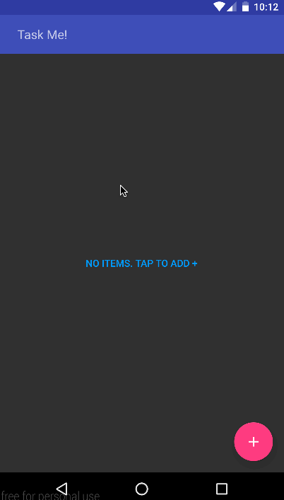

# Pre-work - Task Me!

Task Me is an android app that allows building a todo list and basic todo items management functionality including adding new tasks, editing and deleting an existing tasks.

Submitted by: Yogesh Shrivastava

Time spent: 12-14 hours spent in total

## User Stories

The following **required** functionality is completed:

* [x] User can **successfully add and remove items** from the todo list
* [x] User can **tap a todo item in the list and bring up an edit screen for the todo item** and then have any changes to the text reflected in the todo list.
* [x] User can **persist todo items** and retrieve them properly on app restart

The following **optional** features are implemented:

* [x] Persist the todo items [into SQLite](http://guides.codepath.com/android/Persisting-Data-to-the-Device#sqlite) instead of a text file (Using Cupboard)
* [x] Improve style and of the todo items in the list [using a recycler view with custom adapter] 
* [x] Add support for completion due dates for todo items (Not displaying in listview as I have added a seperate View screen)
* [x] Add support for selecting the priority of each todo item (and display in listview item)
* [x] Tweak the style improving the UI / UX, play with colors, images or backgrounds
* [ ] Use a [DialogFragment](http://guides.codepath.com/android/Using-DialogFragment) instead of new Activity for editing items

The following **additional** features are implemented:

* [x] Added material design for cool UI features
* [x] Swipe to remove items.
* [x] You can mark items done directly in the list and a strike with show it to be completed

## Video Walkthrough 

Here's a walkthrough of implemented user stories:

GIF created with [LiceCap](http://www.cockos.com/licecap/).

## Notes

Describe any challenges encountered while building the app.

## License

    Copyright [2016] [Yogesh Shrivastava]

    Licensed under the Apache License, Version 2.0 (the "License");
    you may not use this file except in compliance with the License.
    You may obtain a copy of the License at

        http://www.apache.org/licenses/LICENSE-2.0

    Unless required by applicable law or agreed to in writing, software
    distributed under the License is distributed on an "AS IS" BASIS,
    WITHOUT WARRANTIES OR CONDITIONS OF ANY KIND, either express or implied.
    See the License for the specific language governing permissions and
    limitations under the License.
